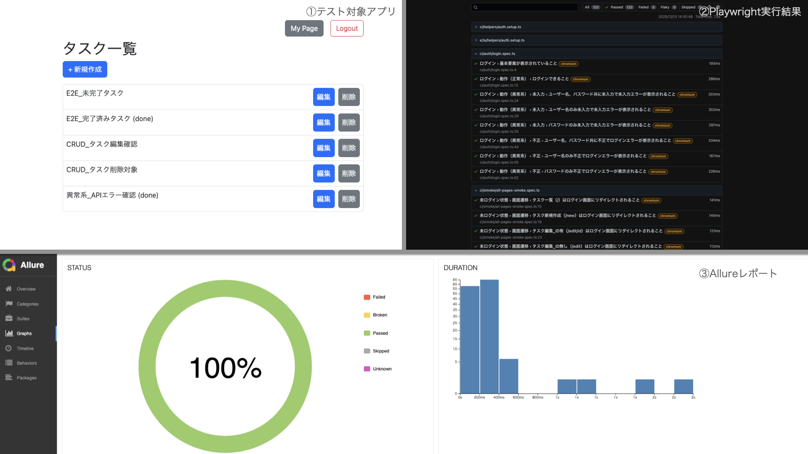

## 概要

本リポジトリは、QA エンジニアとして Playwright を用いた E2E / API テスト設計および CI 化の理解・実装力を示すためのポートフォリオです。

- Playwright による自動化
  - 表示テスト
  - 動作テスト（CRUD）
  - API テスト
  - API モックによる表示テスト
  - Allure によるレポート表示
- CI
  - GitHub Actions
- テスト対象
  - Python（Flask）による TODO アプリ

## テスト対象システム（デモアプリ）

自動テストを実装するにあたり、テスト対象として自動化で多くの場面で必要になるであろう「認証、CRUD、API」を持つ、  
（テスト実装を目的とした）最小構成の TODO 管理アプリを開発しました。

- 主な機能
  - ログイン認証
  - タスク一覧
  - タスク作成
  - タスク編集（タスク名、完了状態）
  - タスク削除
  - マイページ（スタッツ確認 API 含む）

## テスト方針・設計の考え方

テストファイルは基本的に機能ごとに分かれています。

- smoke：全画面のスモークテスト
- auth：ログイン周りの機能テスト
- tasks：画面別の機能テスト
- mypage：画面別の機能テスト、スタッツ確認 API の動作テスト、API モックでの UI 表示テスト
- visual：簡易なビジュアルリグレッションテスト

ローカル実行用のテストは、テスト対象が小さいアプリのため、網羅的に確認できるよう観点を作成。  
複数ユーザーが利用しているアプリという前提で認証周りはやや詳細な観点も追加しています。

CI 用のテストは、実行時間も考慮してローカル実行用のテストから最低限のテストのみ切り出しています。

## テスト観点表（テスト設計）

ローカル実行用の網羅的なテストについては事前にテスト観点表を作成し、  
機能・状態・異常系を整理した上でテスト実装を行っています。

- テスト観点表（共有用 Google スプレッドシート）  
  [テスト観点表（ローカル実行用・網羅）](https://docs.google.com/spreadsheets/d/158UulTjsnd21sNucOYFfsGv1f3qmqnw5LMF76iaA3a8/edit?usp=sharing)

本観点表では、以下を意識して設計しています。

- 画面・API 単位での観点整理
- 正常系だけでなく、異常系を考慮
- 複数ユーザーが利用するアプリを想定した認証・権限周りの観点追加

## テスト構成・ディレクトリ構造

※主要なもののみ

```
playwright-flask-portforio/
    flask-app/ ※デモアプリ
    playwright-tests/
        .github/
            workflows/
                playwright.yml ※Github Actions の CI
    .auth/ ※認証情報が保存されるディレクトリ
    tests/
        e2e/ ※ローカル実行用の網羅的なテストケース
            auth/
                login.spec.ts ※ログイン画面のテスト
            fixtures/ ※テストで利用するフィクスチャーを格納
                apiClient.ts ※認証済み API を準備するファイル
            helpers/ ※テストで利用するヘルパーを格納
                    auth.setup.ts ※ログイン認証保持を実装したファイル
                    tasks.ts ※各テストで頻繁に利用する関数を定義したファイル
            mypage/
                mypage-basic.spec.ts ※マイページのテスト
                mypage-api.spec.ts ※マイページのスタッツ API のテスト
            smoke/
                all-pages-smoke.spec.ts ※全画面のスモークテスト
            tasks/
                tasks-list.spec.ts ※タスク一覧画面のテスト（画面が存在しないタスク削除のテストを含む）
                tasks-create.spec.ts ※新規作成画面のテスト
                tasks-edit.spec.ts ※タスク編集画面のテスト
            visual/
                mypage-basic-v.spec.ts ※マイページのビジュアルリグレッション（簡易）
                tasks-list.spec-v.ts ※タスク一覧画面のビジュアルリグレッション（簡易）
        ci/ ※CI 用にテストを切り出し
            auth/
                login.spec.ts ※ログイン画面のテスト
            helpers/ ※テストで利用するヘルパーを格納
                auth.setup.ts ※ログイン認証保持を実装したファイル
                tasks.ts ※各テストで頻繁に利用する関数を定義したファイル
            smoke/
                all-pages-smoke.spec.ts ※全画面のスモークテスト
    .env.example ※環境設定ファイルの例
```

## CI / 自動化について

CI では時間短縮の意味もあり、最小限の E2E（Chromium headless） を実行しています。  
網羅的なテストはローカル実行を想定しています。  
今回はポートフォリオ用ということもあり、CI 用テストとローカル用テストでディレクトリを分ける設計としています。

## レポート（Allure）

本ポートフォリオでは Allure を最小構成で導入しています。  
これは、テストケース自体が機能単位・観点単位で整理されており、過度な annotation を付与しなくてもレポートとして十分に可読性を保てる構成になっているためです。  
実務では、規模や運用体制に応じて step / severity / feature の付与を検討する想定です。

レポートは GitHub Pages 上で確認できるようにしています。  
[Allure レポート](https://rh-e2e-dev.github.io/playwright-flask-portfolio/public/allure-report/)

## 実行方法

※node, pnpm 導入環境にて

1. リポジトリを clone  
   git clone https://github.com/xxxx/playwright-flask-portfolio.git
2. 依存関係をインストール  
   cd playwright-tests  
   pnpm install  
   pnpm exec playwright install
3. テスト実行  
   pnpm exec playwright test
4. Allure レポート生成・確認  
   pnpm exec allure generate  
   pnpm exec allure open

### デモアプリ（Flask）について

本ポートフォリオでは、Playwright による自動テストの対象として、Python（Flask）で簡易的な TODO 管理アプリを実装しています。  
ローカルでテストを実行する場合は、事前にデモアプリを起動してください。

※Python 等の導入環境にて  
（詳細は flask-app 内の.python-version と requirements.txt に記載があります）

1. デモアプリを実行  
   cd flask-app  
   python app.py  
   ※ CI では GitHub Actions 上で Flask アプリを起動した上で Playwright テストを実行しています。

### CI（GitHub Actions）

GitHub Actions を利用して、push / pull request 時に Flask アプリを起動し、Playwright による E2E テストを実行しています。

実行結果は「Actions」タブから確認できます。

## 今後の改善予定

- GitHub Pages 公開
- ビジュアルリグレッションテストの拡充
- テスト分類の調整(Allure)
